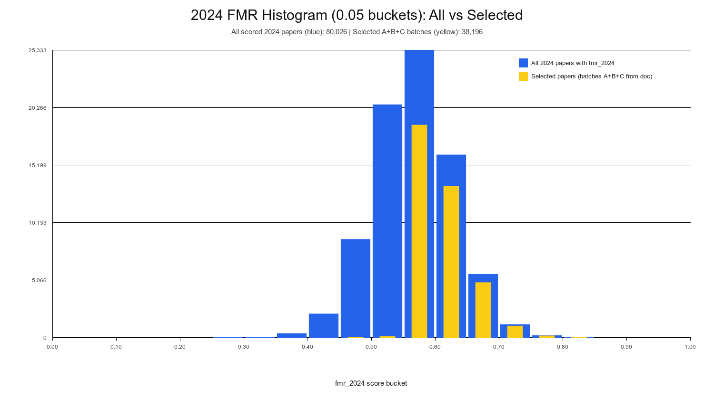

# 2024 Tranche Totals + 2025 Comparison (All 2024 selection runs)

Date: 2026-02-12

This document now includes **all 2024 selection batches we queued**, not just the latest pass.

---

## Policy reference

From `2024_ARXIV_FILTER_SPEC.md`:

- `>= 0.60`: category-only, queue
- `0.55–0.60`: category-only, queue
- `0.50–0.55`: category + `combined_hits >= 1`
- `0.40–0.50`: category + `combined_hits >= 2`

Core categories:

`cs.LG, cs.CL, cs.AI, cs.CV, cs.IR, cs.NE, stat.ML, cs.MA, cs.SD, eess.AS, eess.IV`

Term sources used for `combined_hits` in the all-tranche pass:

- Word-cloud terms (`queries/word_clouds_2024/*.txt`): 2,672 terms
- 2024 FMR anchors (`details_json.best_anchor`): 1,241 terms

---

## 2024 selection batch history (all runs)

### Batch A — manual top-500 seed
- `created_at`: `2026-02-11T22:08:06.876959+00:00`
- Rows inserted: **500**
- Selection mode: manual top-500 by 2024 score (`COALESCE(fmr_2024, fmr_score)`), no category/term gating
- Insert-time score range (logged at insertion): **0.6365 .. 0.7783**

### Batch B — top two tranches (large run)
- `created_at`: `2026-02-12T06:34:05.564619+00:00`
- Rows inserted: **25,205**
- Selection mode: top two tranches only (`>=0.60` and `0.55–0.60`), core categories
- Intended tranche counts at insertion:
  - `>=0.60`: **12,448**
  - `0.55–0.60`: **12,757**

### Batch C — all-tranche policy pass
- `created_at`: `2026-02-12T09:46:19.639246+00:00`
- Rows inserted: **12,491**
- Candidate pool scanned (unseen, core, `fmr>=0.40`): **29,216**
- Selected:
  - `>=0.60`: **6,307**
  - `0.55–0.60`: **6,184**
  - `0.50–0.55`: **0**
  - `0.40–0.50`: **0**
- Rejected (reason):
  - `0.50–0.55`: **12,307** rejected; all had `combined_hits=0` (needed `>=1`)
  - `0.40–0.50`: **4,418** rejected; all had `combined_hits=0` (needed `>=2`)

---

## Grand total selected across all 2024 runs

Total rows inserted across A+B+C:

- **38,196** (= 500 + 25,205 + 12,491)

### Current-score tranche audit of all selected rows (A+B+C)

Using current `COALESCE(fmr_2024, fmr_score)` on those 38,196 selected rows:

- `>=0.60`: **19,366**
- `0.55–0.60`: **18,738**
- `0.50–0.55`: **87**
- `0.40–0.50`: **5**

Note: the small `0.50–0.55` and `0.40–0.50` tails appear because scores can drift after rescoring; they were not selected as lower-band hits in the large tranche runs.

---

## Remaining unseen lower-band pool after these runs

Unseen (core-category, 2024) pool still not inserted:

- `0.50–0.55`: **12,307**
- `0.40–0.50`: **4,418**

Reason: term-hit thresholds fail in current term/anchor set.

---

## Comparison to 2025 tranche snapshot

From `2025_ARXIV_FILTER_METHOD.md` snapshot:

- `0.55–0.60`: **11,531** selected
- `0.50–0.55`: **18,446** selected
- `0.40–0.50`: **7,845** selected
- Snapshot total listed there: **37,822**
- (`>=0.60` handled separately in that doc)

### High-level comparison

- 2024 total selected across our runs: **38,196**
- 2025 snapshot listed total: **37,822**
- Difference: **+374** (2024 higher in total selected rows)

### Shape difference

- 2024 selections are heavily concentrated in top bands (`>=0.55`), with lower bands mostly rejected by term-hit thresholds in the all-tranche pass.
- 2025 snapshot includes substantial lower-band intake (`0.50–0.55`, `0.40–0.50`).

---

## Histogram: all 2024 papers vs selected (0.05 buckets)

Generated files:

- `2024_fmr_histogram_all_vs_selected_0p05.png`
- `2024_fmr_histogram_all_vs_selected_0p05.csv`

Definition used:
- **Blue** = all 2024 papers with `fmr_2024` populated (`llm_relevant=1`)
- **Yellow** = selected 2024 papers from batches A+B+C in this document

## Caveat

This 2024 accounting aggregates multiple runs with different selection modes (manual top-500 seed + tranche policy runs). Treat cross-year comparisons as directional unless normalized to one identical one-pass policy and one fixed score snapshot time.
