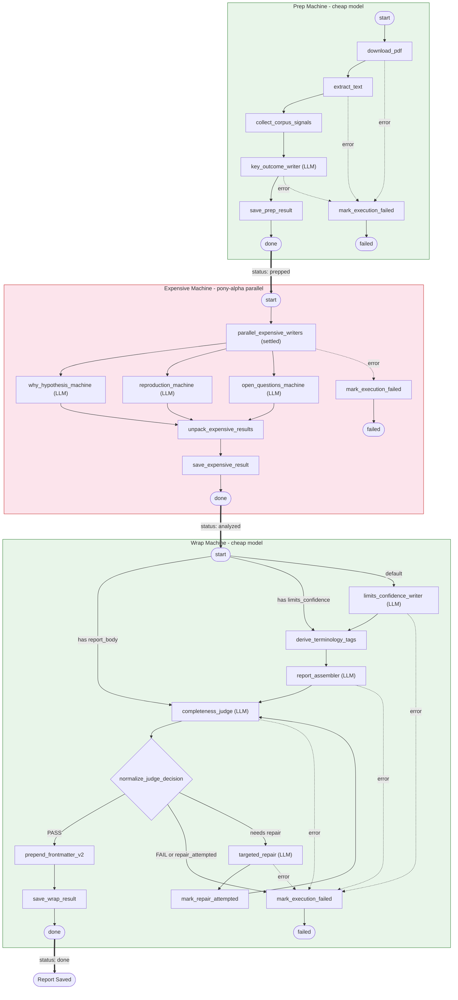

# V2 Pipeline Architecture

## LLM Calls Per Paper

| Stage | Model | Agent Calls | Notes |
|---|---|---|---|
| **Prep** | cheap | 1 | key_outcome_writer |
| **Expensive** | pony-alpha | 3 | why + reproduction + open_questions (parallel) |
| **Wrap** | cheap | 3-5 | limits + assembler + judge + (repair + re-judge) |
| **Total** | | **7-9** | Per paper, assuming 1 repair pass max |
